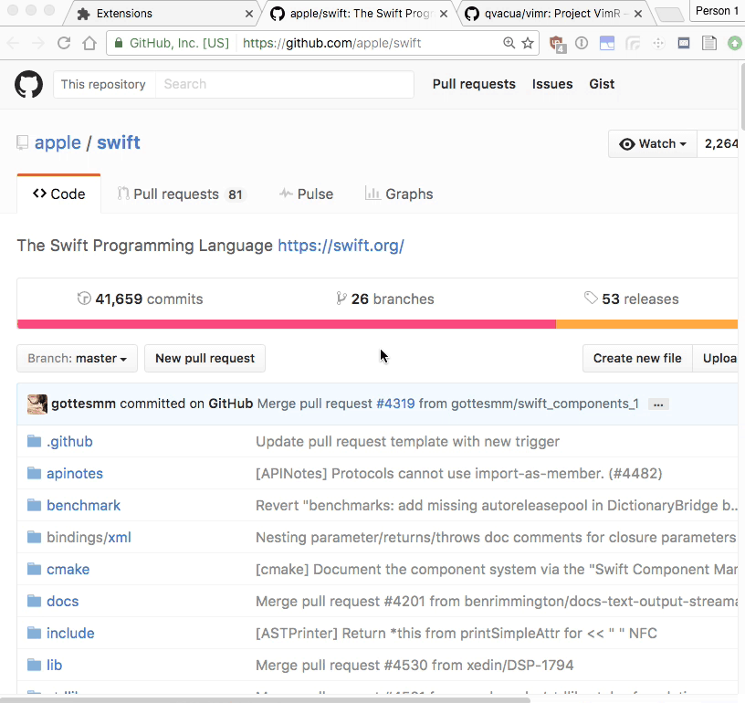

# Tabist

## About

Simple extension to help you find where that tab you were looking for is and activates it when you click on the link

Available for [Chrome](https://chrome.google.com/webstore/detail/tabist/hdjegjggiogfkaldbfphfdkpggjemaha) and [Firefox](https://addons.mozilla.org/en-US/firefox/addon/tabist/)

## Example

## Development Setup

To setup the build environment the first time you need to install npm and webpack. After that you can compile the sources by navigating to the project directory and run `npm install` to install dependencies for webpack to run successfully.

To build the final javascript bundle you can run `webpack` or to have webpack try to rebuild the files when you save you can use `webpack --display-error-details -w` from the same folder.

To install the bare webextension in firefox you can navigate to `about:debugging` and then click on `Load Temporary Add-on` and navigate to the `manifest.json` file.

To install in chrome you can navigate to `chrome://extensions/` and check the `Developer mode` checkbox and then click on `Load unpacked extension` and navigate to the `manifest.json` file.

## Limitations

Right now there is a [bug in firefox](https://bugzilla.mozilla.org/show_bug.cgi?id=1289213) that prevents the unloaded tabs from displaying the cached title until they are re-loaded. This is landed and scheduled for Firefox 51 (Will be released to the general public on 1/24/2017).

[Additional bugfix related to this extension that will be landed in Firefox 51](https://bugzilla.mozilla.org/show_bug.cgi?id=1291830)
